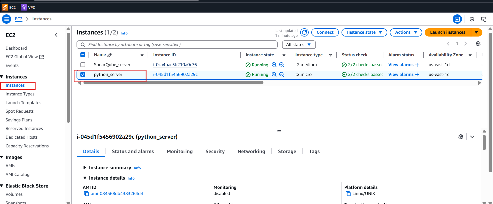

# Python Code Analysis with SonarQube Integration

This document provides a step-by-step guide to set up SonarQube for analyzing a Python project using two AWS EC2 instances.

---

## Step 1: Create EC2 Instance for Python Project

- **Instance Name**: `Python_server`
- **OS**: Ubuntu (latest version)
- **Instance Type**: t2.micro
- **Key Pair**: Choose or create one
- **Security Group**:
  - Allow **SSH (22)**
- **Network**: Default or custom
- **Storage**: Default

> Launch the instance after configuration.



---

## Step 2: Connect to Python Server and Set Up Environment

1. **Connect to the instance:**
   ```bash
   ssh -i "<your-key>.pem" ubuntu@<Python_Server_Public_IP>
   ```

2. **Update the system:**
   ```bash
   sudo apt update
   ```

3. **Clone the project repository:**
   ```bash
   git clone https://github.com/xaravind/Documentation.git
   cd Documentation/python code
   ```

4. **Download and install SonarScanner:**
   ```bash
   wget https://binaries.sonarsource.com/Distribution/sonar-scanner-cli/sonar-scanner-cli-5.0.1.3006-linux.zip
   sudo apt install unzip
   unzip sonar-scanner-cli-5.0.1.3006-linux.zip
   sudo mv sonar-scanner-5.0.1.3006-linux /opt/sonar-scanner
   echo 'export PATH=$PATH:/opt/sonar-scanner/bin' >> ~/.bashrc
   source ~/.bashrc
   ```

---

## Step 3: Create EC2 Instance for SonarQube

- **Instance Name**: `SonarQube_server`
- **OS**: Ubuntu (latest version)
- **Instance Type**: t2.medium
- **Key Pair**: Use the same or another
- **Security Group**:
  - Allow **SSH (22)**
  - Allow **Custom TCP (9000)**
- **Network**: Default or custom
- **Storage**: Default

> Launch the instance after configuration.


---

## Step 4: Set Up SonarQube Server

1. **Connect to the SonarQube instance:**
   ```bash
   ssh -i "<your-key>.pem" ubuntu@<SonarQube_Server_Public_IP>
   ```

2. **Update the system:**
   ```bash
   sudo apt update
   ```

3. **Install Java JDK:**
   ```bash
   sudo apt install openjdk-17-jdk
   ```

4. **Download and set up SonarQube:**
   ```bash
   wget https://binaries.sonarsource.com/Distribution/sonarqube/sonarqube-25.4.0.105899.zip
   sudo apt install unzip
   unzip sonarqube-25.4.0.105899.zip
   cd sonarqube-25.4.0.105899/bin/linux-x86-64/
   ./sonar.sh start
   # Optional: Check status
   ./sonar.sh status
   ```

---

## Step 5: Access SonarQube Web Interface

1. Open a browser in **Incognito Mode**.
2. Visit:
   ```
   http://<SonarQube_Public_IP>:9000
   ```
3. **Login with default credentials:**
   - Username: `admin`
   - Password: `admin`
4. Change the password when prompted.
5. **Create a new project** and generate a token.

---

## Step 6: Run SonarScanner from Python Server

1. Go back to the **Python Server**.
2. Run the following command using your project key and token:
   ```bash
   sonar-scanner \
     -Dsonar.projectKey=Python_project \
     -Dsonar.sources=. \
     -Dsonar.host.url=http://54.227.26.153:9000 \
     -Dsonar.token=sqp_ea6e132ba17054ca225a210073e78a8494c948aa
   ```

> ✅ If successful, you'll see `EXECUTION SUCCESS`.

---

## Step 7: View Analysis Results

- Go back to the **SonarQube Web UI**.
- Open your project dashboard.
- Review analysis results: bugs, vulnerabilities, code smells, and more.

---

### ✅ SonarQube integration for Python code analysis is now complete!
