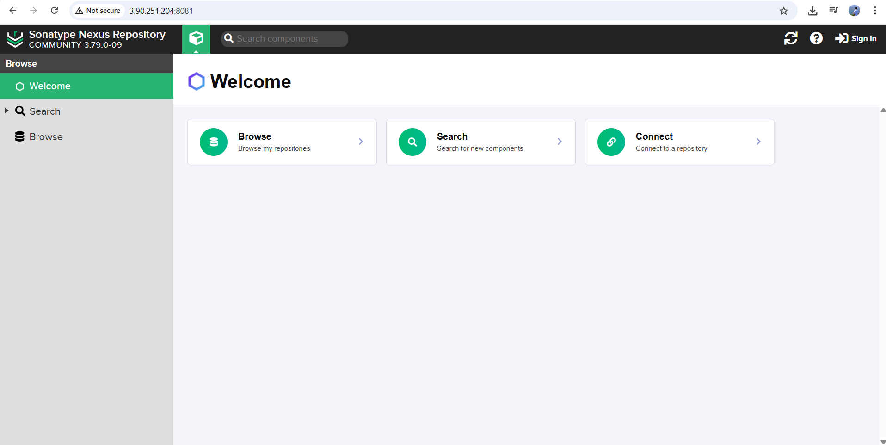
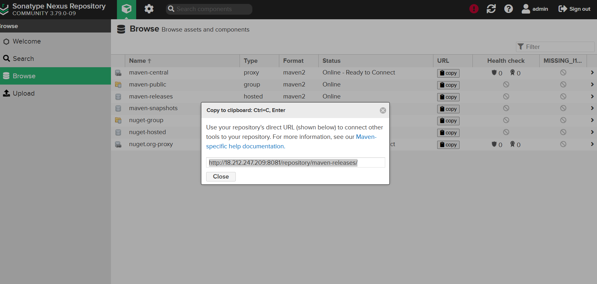
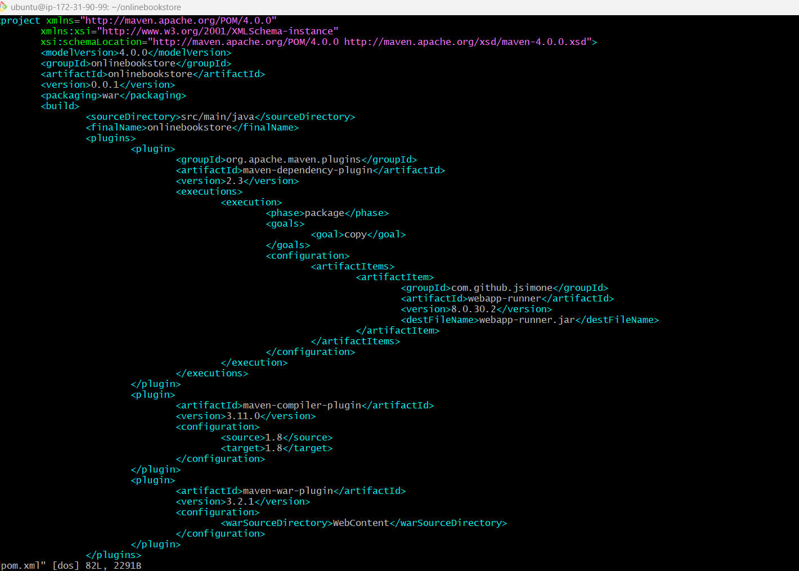
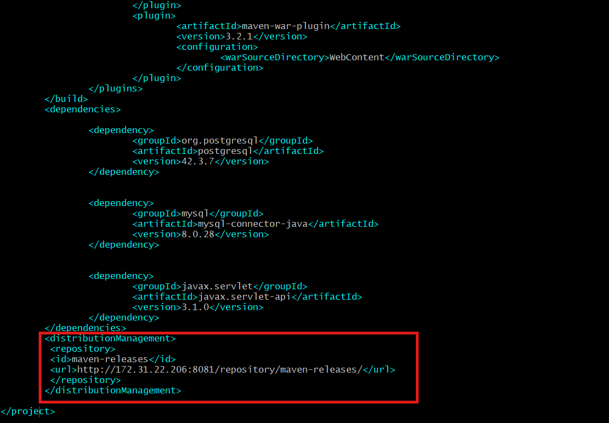
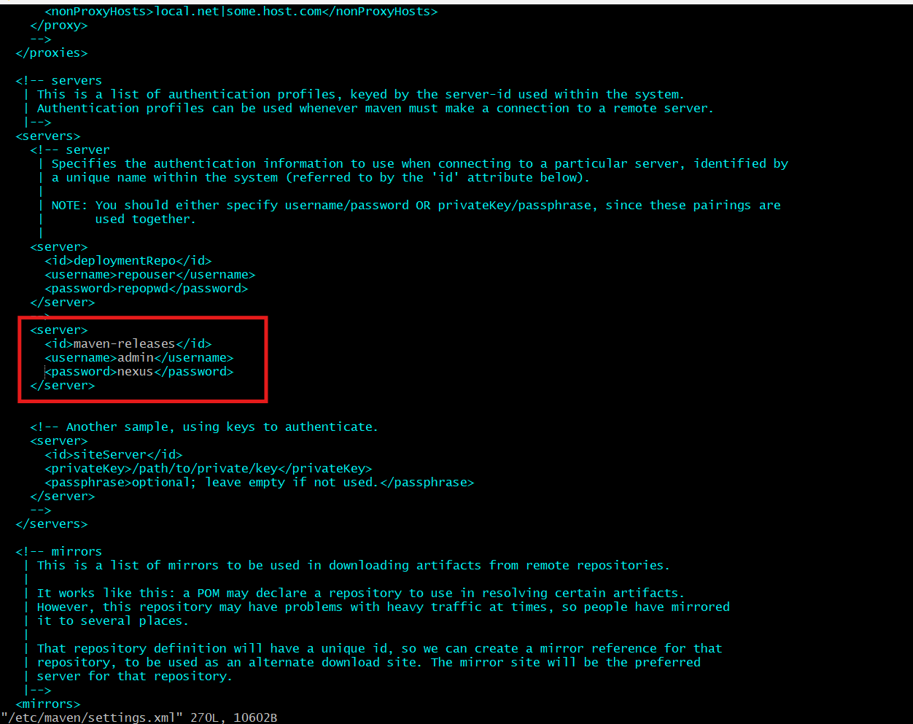
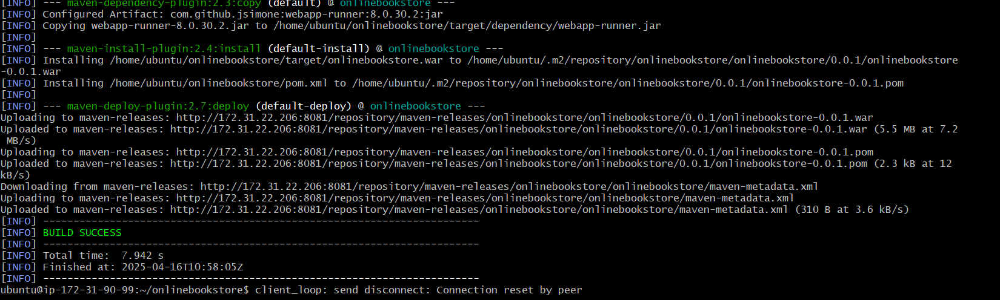
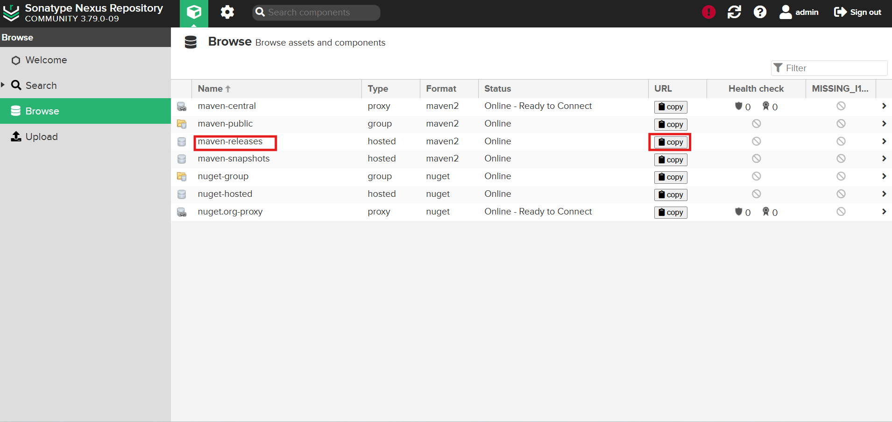
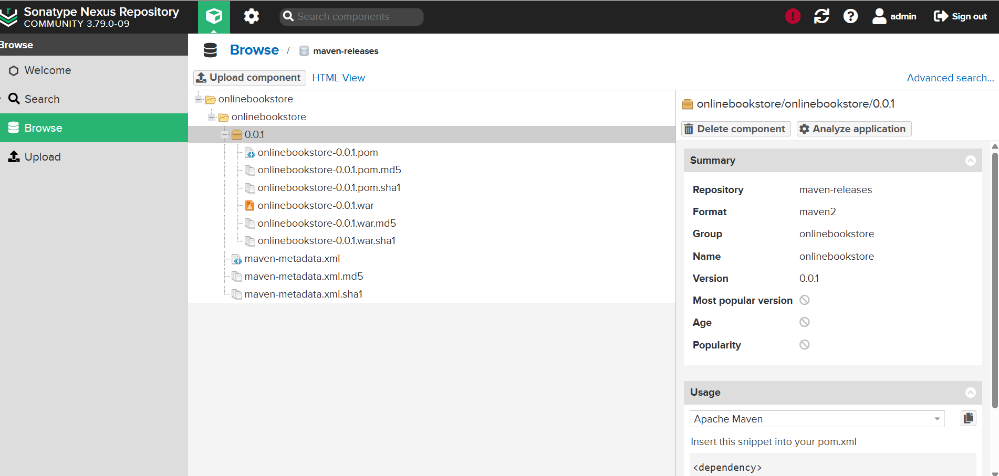

# Nexus Repository & Java Build Setup Guide

## STEP 1: Launch EC2 Instances

- Create **2 EC2 instances** with `t2.medium` type:
  - One for **Java Build**
  - One for **Nexus Installation**
- Set the **Security Group** to allow:
  - `SSH (22)`
  - `HTTP (8081)`

---

## STEP 2: Install Java

```bash
sudo apt updatEs
sudo apt install openjdk-11-jdk -y
java -version
```

---

## STEP 3: Download Nexus

```bash
wget https://download.sonatype.com/nexus/3/nexus-unix-x86-64-3.79.0-09.tar.gz
tar -xvzf latest-unix.tar.gz
sudo mv nexus-3* /opt/nexus
sudo mv sonatype /opt/
```

---

## STEP 4: Create Nexus User Profile

```bash
sudo adduser nexus
sudo chown -R nexus:nexus /opt/nexus
sudo chown -R nexus:nexus /opt/sonatype-work
```

---

## STEP 5: Create a Nexus Service File

```bash
sudo nano /etc/systemd/system/nexus.service
```

Paste the following content:

```ini
[Unit]
Description=nexus service
After=network.target

[Service]
Type=forking
LimitNOFILE=65536
ExecStart=/opt/nexus/bin/nexus start
ExecStop=/opt/nexus/bin/nexus stop
User=nexus
Restart=on-abort

[Install]
WantedBy=multi-user.target
```

---

## STEP 6: Start and Enable Nexus

```bash
sudo systemctl enable nexus
sudo systemctl start nexus
```

- Open your browser and go to:  
  `http://<your-server-ip>:8081`

- To get the admin password:

```bash
cat /nexus-data/admin.password
```


- After login we can click on Maven-Release and click copy, then we need to copy a httplink and mention in below pom.xml script.

---

## STEP 7: Java Build on Second Server

```bash
git clone https://github.com/shashirajraja/onlinebookstore.git
cd onlinebookstore
sudo apt install maven -y
mvn package
```

- The artifact will be generated after the build.

---

## STEP 8: Configure pom.xml for Nexus Deployment

Edit the `pom.xml` file:

```xml
<distributionManagement>
    <repository>
        <id>maven-releases</id>
        <url>http://172.31.22.206:8081/repository/maven-releases/</url>
    </repository>
</distributionManagement>
```



> Replace the IP with the **private IP** of your Nexus instance.

---

## STEP 9: Configure Maven Credentials

Edit the `settings.xml` file:

```bash
vi /etc/maven/settings.xml
```

Add the following inside `<servers>` tag:

```xml
<server>
    <id>maven-releases</id>
    <username>admin</username>
    <password>Admin@123</password>
</server>
```

---

## STEP 10: Clean and Deploy to Nexus

```bash
mvn clean deploy
```


> This wil build the artifact and deploy it to the **Nexus Maven Releases** repository.



